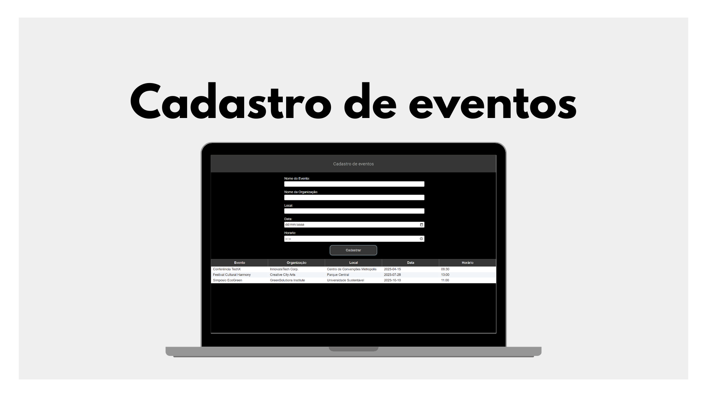

<h1 align="center"> Cadastro de Eventos </h1>

  <a href="#-tecnologias">Tecnologias</a>&nbsp;&nbsp;&nbsp;|&nbsp;&nbsp;&nbsp;
  <a href="#-projeto">Projeto</a>&nbsp;&nbsp;&nbsp;|&nbsp;&nbsp;&nbsp;
  <a href="#-Banco de dados">Banco de dados</a>&nbsp;&nbsp;&nbsp;|&nbsp;&nbsp;&nbsp;
  <a href="#memo-licença">Licença</a>

 

  

## 🚀 Tecnologias

Esse projeto foi desenvolvido com as seguintes tecnologias:

- HTML e CSS
- Java, JSF, Primefaces, Tomcat, PostgreSQL, JPA, Hibernate, PMD
- Git e Github

## 💻 Projeto

Cadastro de Eventos é uma aplicação web de código aberto que permite aos usuários criar, visualizar, atualizar e excluir eventos com facilidade. Seja você um organizador de eventos, uma empresa que deseja manter um calendário de atividades ou um entusiasta que quer manter um registro de eventos pessoais.

## 💾 Banco de dados

A tabela de eventos no banco de dados segue o seguinte esquema:

| Campo       | Tipo              | Restrições                          |
| ----------- | ----------------- | -----------------------------------|
| id          | integer           | NOT NULL, PRIMARY KEY, DEFAULT nextval('evento_id_seq'::regclass) |
| nome        | character varying(255) | |
| organizacao | character varying(255) | |
| local       | character varying(255) | |
| data        | character varying(255) | |
| horario     | character varying(255) | |

## :memo: Licença

Esse projeto está sob a licença MIT.

---